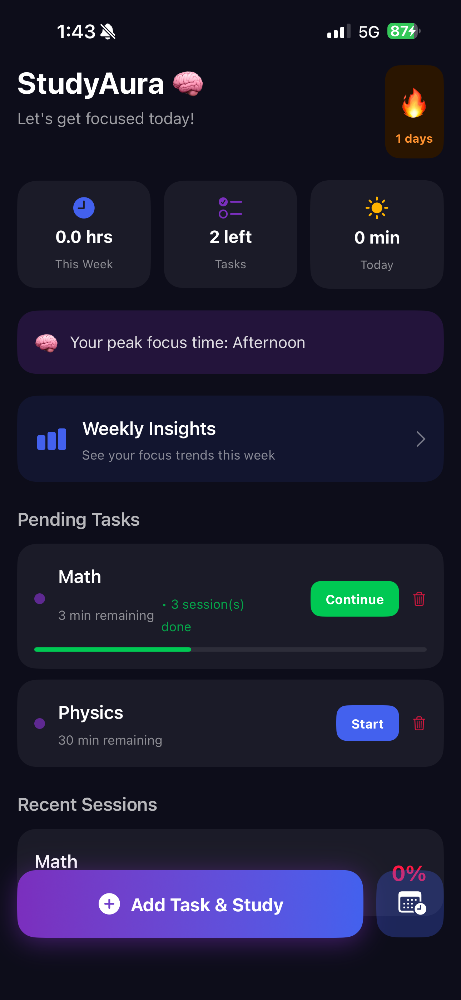
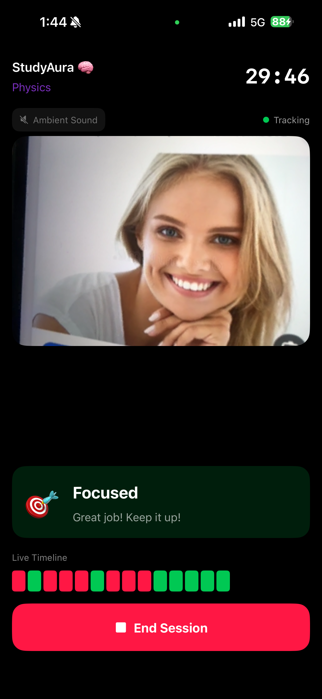
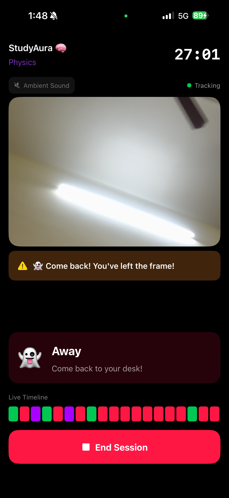
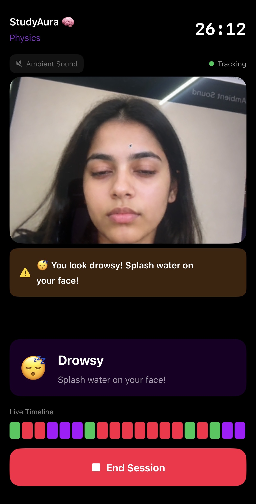
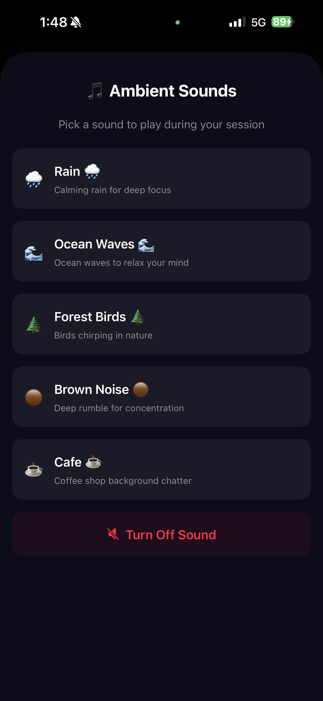
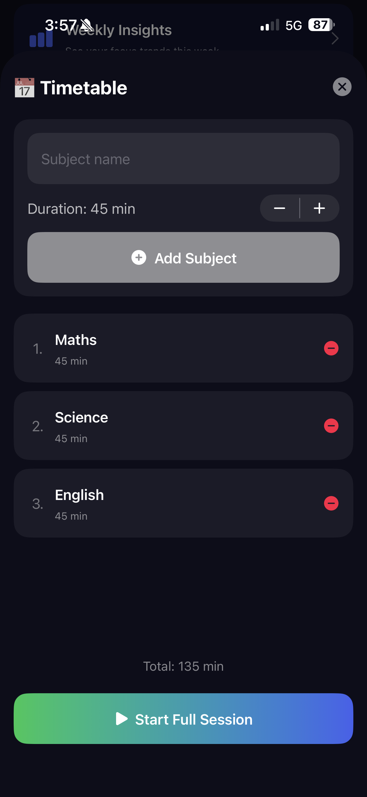
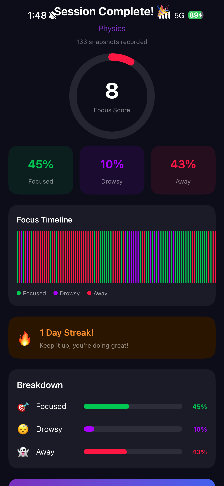
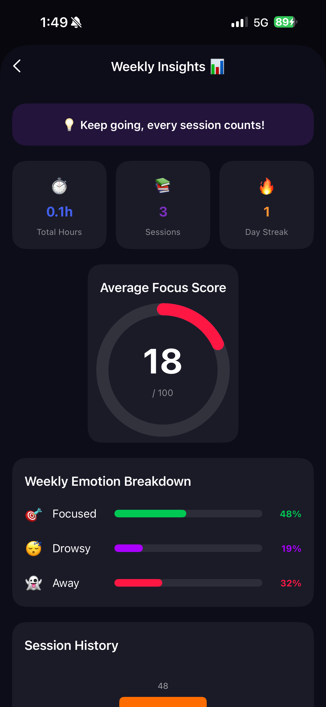
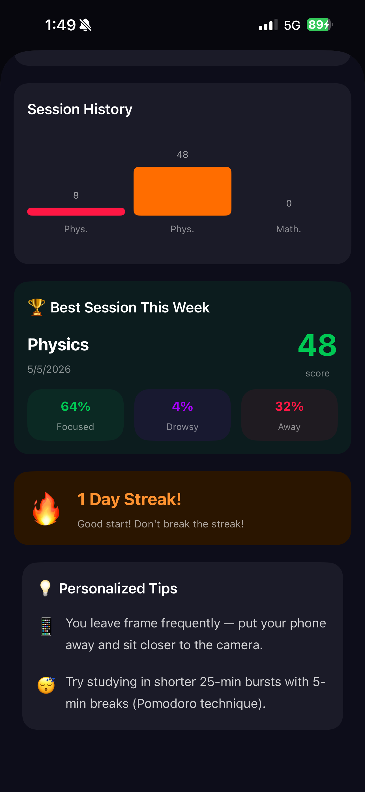

# StudyAura 
### AI-Powered Focus Tracker for Students

> Built by **Palli Rithika Reddy**

StudyAura is an iOS app that helps students stay focused while studying using real-time facial emotion detection. It tracks your focus, alerts you when you're drowsy or distracted, and gives you detailed session reports.

---
##  Demo

[](https://drive.google.com/file/d/1QcBY7nasA2Csu4mQeRdNrALizlJUV_O_/view?usp=sharing)
##  Screenshots

| Home Screen | Live Session | Away Alert |
|---|---|---|
|  |  |  |

| Drowsy Alert | Ambient Sound | Timetable |
|---|---|---|
|  |  |  |

| Session Summary | Weekly Insights | Weekly Insights 2 |
|---|---|---|
|  |  |  |

---

##  Features

###  Real-Time Focus Tracking
- Uses Apple's **Vision Framework** to detect facial landmarks
- Detects Focused , Drowsy , and Away  states live
- Live colour-coded timeline updated every second

###  Smart Alerts
- **3x haptic buzz** when drowsy detected
- **2x haptic buzz** when you leave the frame
- On-screen alert banner with message

###  Ambient Sound Player
- Rain  : Calming rain for deep focus
- Ocean Waves  : Relaxing wave sounds
- Forest Birds  : Nature sounds
- Brown Noise  : Deep rumble for concentration
- Cafe   : Coffee shop background chatter
- Loops infinitely until stopped

### Smart Task Management
- Add tasks with subject + duration
- Tracks **remaining time** ; resume exactly where you left off
- Progress bar shows completion
- Sessions history per task

###  Timetable Builder
- Add multiple subjects with durations
- **Start Full Session** ; goes through all subjects one by one
- Shows total study time

###  Session Summary
- Animated **Focus Score** (0–100)
- Focused / Drowsy / Away breakdown
- Colour-coded **Focus Timeline** chart
- Streak tracker 

###  Weekly Insights Dashboard
- Average focus score across all sessions
- Total hours studied + session count
- Session history bar chart
- Best session of the week 
- **Personalized tips** based on your patterns

---

##  Tech Stack

| Technology | Usage |
|---|---|
| **SwiftUI** | UI Framework |
| **Vision Framework** | Facial landmark detection |
| **AVFoundation** | Camera + audio playback |
| **UserDefaults** | Local data persistence |
| **UIKit Haptics** | Vibration alerts |

---

##  Project Structure
StudyAura/
├── EmotionModel.swift          # Emotion states + session data models
├── StudyStore.swift            # App state management + persistence
├── FaceEmotionAnalyzer.swift   # Vision framework face tracking engine
├── CameraPreview.swift         # AVFoundation live camera preview
├── SharedComponents.swift      # Reusable UI components + color system
├── HomeView.swift              # Main dashboard
├── LiveSessionView.swift       # Study session + ambient sounds + alerts
├── SummaryView.swift           # Post-session summary screen
├── WeeklyInsightsView.swift    # Weekly analytics dashboard
├── TimetableView.swift         # Multi-subject timetable builder
├── TodoSetupView.swift         # Add new study task
└── ContentView.swift           # App entry point

---

##  How to Run

1. Clone the repo:
```bash
git clone https://github.com/rithikareddy714-bit/StudyAura.git
```

2. Open `StudyAura.xcodeproj` in **Xcode 15+**

3. Connect your **iPhone** (front camera required)

4. Set your **Apple ID** under Signing & Capabilities

5. Set deployment target to **iOS 16.0**

6. Press **▶ Run**

>  Must run on a real iPhone : camera tracking doesn't work on simulator

---

##  How It Works
Front Camera → Vision Framework → Eye Openness + Head Yaw
↓
Emotion Classification Engine
↓
Focused  / Drowsy  / Away 
↓
Haptic Alert + Banner + Timeline + Session Data
↓
Summary Report + Weekly Insights
---

##  Future Plans

-  Pomodoro timer mode
-  iCloud sync
-  Study leaderboard with friends
-  Apple Watch companion
-  Export PDF study report
-  Siri shortcuts

---

##  Developer

**Palli Rithika Reddy**
 Student

Built  using SwiftUI + Apple Vision Framework

[](https://github.com/rithikareddy714-bit)

---

## License

This project is licensed under the MIT License.
